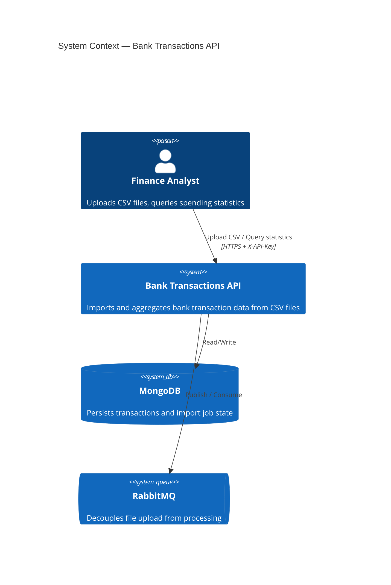
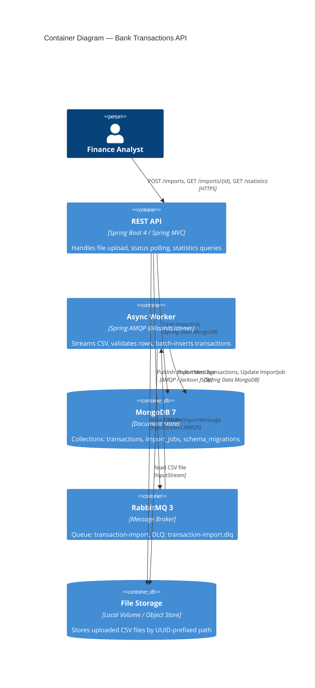
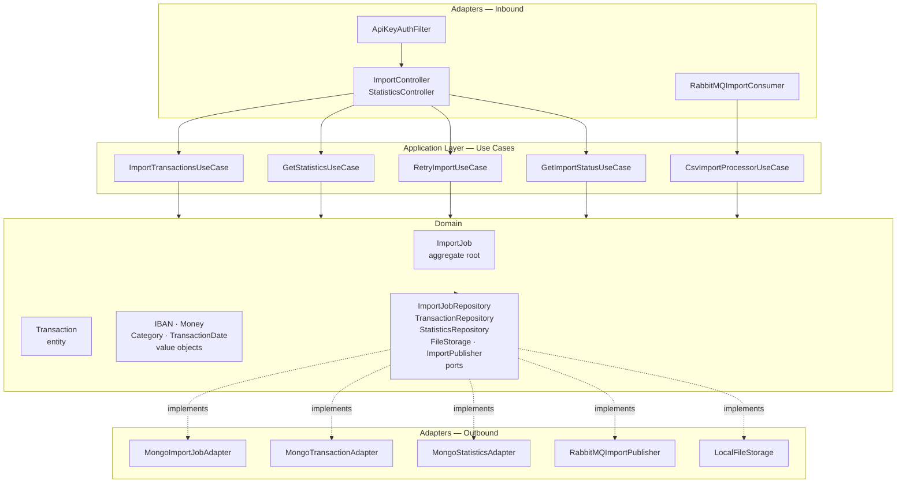

# Bank Transactions API

A production-grade backend for importing, processing, and aggregating bank transaction data from CSV files. Built as a portfolio showcase of **Domain-Driven Design**, **Hexagonal Architecture**, and **Spec-Driven Development** on Spring Boot 4.

---

## Quick Start

### 1. Run with Docker Compose

```bash
docker compose up --build
```

This starts **MongoDB**, **RabbitMQ**, and the **app** in the correct order (the app waits for both dependencies to pass their health checks before starting).

| Service | URL | Credentials |
|---|---|---|
| REST API | http://localhost:8080/transactions/v1 | `X-API-Key: dev-api-key-change-me` (no key needed locally) |
| Swagger UI | http://localhost:8080/swagger-ui/index.html | — |
| RabbitMQ Management | http://localhost:15672 | `myuser` / `secret` |
| MongoDB | localhost:27017 | `root` / `secret` |

To override the API key or passwords for production:

```bash
API_KEY=your-strong-key \
MONGO_PASSWORD=your-strong-password \
RABBITMQ_PASSWORD=your-strong-password \
docker compose up -d
```

### 2. Try the API with IntelliJ HTTP Client

Open **`requests.http`** at the project root in IntelliJ IDEA. Click the green ▶ next to any request to run it.

The file is organised in three sections:

| Section | What it covers |
|---|---|
| **Imports** | Upload CSV (inline · 100 · 500 · 10 000 rows), poll status, retry, unauthorized |
| **Statistics** | All filter combos (`category`, `iban`, `month`), pagination, unauthorized |
| **Health** | Actuator health check |

> **Tip — chained requests:** the `Upload CSV file` request is named `# @name uploadCsv`. After running it, the `@importId` variable is automatically populated from the response, so status and retry requests work without copy-pasting.

Large test CSV files are in `test-data/` and are streamed directly from disk via IntelliJ's `< ./test-data/filename.csv` syntax.

### 3. Explore with Swagger UI

Open http://localhost:8080/swagger-ui/index.html in a browser. All endpoints are documented with request/response schemas. Security is disabled by default locally, so no key is needed. To authenticate in a security-enabled environment, click **Authorize** and enter your API key.

---

## Table of Contents

1. [Project Overview](#1-project-overview)
2. [Spec-Driven Development](#2-spec-driven-development)
3. [Architecture Overview](#3-architecture-overview)
4. [Business Domain Glossary](#4-business-domain-glossary)
5. [System Design](#5-system-design)
6. [Data Flow](#6-data-flow)
7. [Architecture Diagrams](#7-architecture-diagrams)
8. [API Reference](#8-api-reference)
9. [Testing Strategy](#9-testing-strategy)
10. [Reliability & Resilience](#10-reliability--resilience)
11. [Observability](#11-observability)
12. [Running the System](#12-running-the-system)
13. [Engineering Principles](#13-engineering-principles)
14. [Architecture Decision Records](#14-architecture-decision-records)
15. [Trade-offs & Decisions](#15-trade-offs--decisions)
16. [Future Improvements](#16-future-improvements)

---

## 1. Project Overview

Banks and fintech platforms routinely generate large volumes of transaction data that must be ingested, validated, and surfaced as analytics. This system provides a REST API that:

- Accepts CSV files containing bank transactions (up to 10,000 rows per file)
- Processes them **asynchronously** — upload returns immediately, processing happens in the background
- Persists validated transactions in MongoDB with proper indexing
- Exposes paginated, filtered **statistics** aggregated by category, IBAN, and month

### Real-World Scenario

```
1. Finance analyst uploads May_2024_transactions.csv via POST /imports
   → System responds 202 Accepted with { "importId": "abc-123" }

2. In the background: RabbitMQ consumer streams the CSV, validates each row,
   and batch-inserts valid transactions into MongoDB.
   Invalid rows are counted and logged — processing continues regardless.

3. Analyst polls GET /imports/abc-123
   → { "status": "COMPLETED", "processedRows": 9847, "errorRows": 153 }

4. Analyst queries GET /statistics?category=groceries&month=2024-05
   → Aggregated totals per category, paginated, with full transaction counts
```

### Tech Stack

| Layer | Technology |
|---|---|
| Runtime | Java 26 · Spring Boot 4.0.6 |
| Database | MongoDB 7 (Spring Data MongoDB) |
| Messaging | RabbitMQ 3 (Spring AMQP) |
| Mapping | MapStruct 1.6 |
| CSV Parsing | Apache Commons CSV 1.11 |
| API Docs | Springdoc OpenAPI 3 / Swagger UI |
| Security | Spring Security — API key |
| Observability | Micrometer · Spring Actuator |
| Testing | JUnit 5 · AssertJ · Testcontainers |
| Infrastructure | Docker · Docker Compose |

---

## 2. Spec-Driven Development

### What is SDD?

Spec-Driven Development is a methodology where **explicit specifications drive every layer of the system** before a line of implementation is written. Rather than starting with frameworks and wiring, the team first defines:

- What the **domain** is (entities, value objects, rules)
- What the **use cases** are (ports/interfaces)
- What the **contracts** look like (API, messages, repositories)

Only then are adapters (HTTP, MongoDB, RabbitMQ) written to fulfill those contracts.

### How SDD was applied here

This project was built spec-first through the `CLAUDE.md` specification and the `.claude/` instruction set. Each specification file constrained a layer of the system:

```
.claude/
  architecture.md   → enforced hexagonal layer boundaries and forbidden patterns
  domain.md         → defined entity/value-object design rules and aggregate invariants
  application.md    → defined use case structure and single-responsibility constraints
  api.md            → defined REST controller rules, DTO boundaries, error handling
  persistence.md    → defined MongoDB patterns, indexing strategy, batch operations
  messaging.md      → defined RabbitMQ flow, message shape, reliability guarantees
  performance.md    → defined streaming CSV rules and 10k-row targets
  validation.md     → defined where validation lives (domain vs API boundary)
  testing.md        → defined test pyramid and Testcontainers strategy
```

### The SDD Workflow

```
Specification files
      │
      ▼
Domain Modelling       ← Entities, Value Objects, Aggregates (no Spring, no DB)
      │
      ▼
Use Case Interfaces    ← Ports defined by the Application layer
      │
      ▼
Adapter Implementation ← REST, MongoDB, RabbitMQ adapters implement the ports
      │
      ▼
Integration & Wiring   ← Spring configuration binds everything together
      │
      ▼
Verification           ← Tests validate against the original specification
```

The specifications acted as a **living contract** — if an implementation candidate violated a rule (e.g., putting Spring annotations in a domain class, or calling a repository from a controller), it was rejected by the spec. This kept the architecture clean across all iterations.

---

## 3. Architecture Overview

### Domain-Driven Design

The domain is the **centre of the system** and has zero dependencies on any framework.

**Aggregates**
- `ImportJob` — the aggregate root for the import lifecycle. Owns all state transitions (`PENDING → PROCESSING → COMPLETED/FAILED`) and enforces invariants (e.g., you cannot retry a job that is not `FAILED`).

**Entities**
- `Transaction` — identity-based. Exposes domain behaviour: `isDebit()`, `isCredit()`.

**Value Objects** — immutable, self-validating, equality by value:

| Value Object | Invariant enforced at construction |
|---|---|
| `IBAN` | Regex format `[A-Z]{2}\d{2}[A-Z0-9]{1,30}` |
| `Money` | Non-null amount; currency normalised to uppercase |
| `TransactionDate` | Parsed `LocalDate`; exposes `getYearMonth()` |
| `Category` | Non-blank; normalised to lowercase |

**No anemic domain.** Logic lives in domain objects, not service classes.

### Hexagonal Architecture

```
┌─────────────────────────────────────────────────────────────┐
│                        DOMAIN                               │
│   Transaction · ImportJob · IBAN · Money · Category         │
│   ImportJobRepository (port) · StatisticsRepository (port)  │
└─────────────────────┬───────────────────────────────────────┘
                      │ depends on
┌─────────────────────▼───────────────────────────────────────┐
│                     APPLICATION                             │
│   ImportTransactionsUseCase · CsvImportProcessorUseCase     │
│   GetStatisticsUseCase · RetryImportUseCase                 │
│   FileStorage (port) · ImportPublisher (port)               │
└──────┬──────────────────────────────────────┬───────────────┘
       │ implements                            │ implements
┌──────▼──────────────┐          ┌────────────▼──────────────┐
│   ADAPTERS / IN     │          │   ADAPTERS / OUT          │
│                     │          │                           │
│  REST Controllers   │          │  MongoImportJobAdapter    │
│  RabbitMQ Consumer  │          │  MongoTransactionAdapter  │
│  ApiKeyAuthFilter   │          │  MongoStatisticsAdapter   │
│                     │          │  RabbitMQImportPublisher  │
│                     │          │  LocalFileStorage         │
└─────────────────────┘          └───────────────────────────┘
```

**Dependency rule:** arrows point inward only. Domain knows nothing about Spring, MongoDB, or RabbitMQ.

---

## 4. Business Domain Glossary

| Term | Business Definition |
|---|---|
| **Transaction** | A single financial movement on a bank account — a debit (money out) or credit (money in), with an amount, currency, date, and category. |
| **ImportJob** | A record of a single CSV file upload. It tracks the file's processing lifecycle from receipt through validation to completion, including how many rows succeeded and how many failed validation. |
| **IBAN** | An International Bank Account Number — the globally standardised identifier for a bank account. Every transaction belongs to exactly one IBAN. |
| **Category** | A label classifying what a transaction was for (e.g., groceries, transport, entertainment). Categories are normalised to lowercase for consistent reporting. |
| **Money** | The combination of a numeric amount and a currency code. A negative amount represents money leaving the account; positive represents money arriving. |
| **Statistics** | Aggregated summaries of transactions grouped by category, filtered optionally by IBAN or time period. Used by analysts to understand spending patterns. |

---

## 5. System Design

### Async CSV Ingestion Pipeline

Upload and processing are deliberately decoupled. This allows:
- Immediate HTTP response regardless of file size
- Independent horizontal scaling of the processing worker
- Natural retry semantics for transient failures

```
HTTP Request ──► Store file ──► Create ImportJob ──► Publish message ──► 202 Accepted
                                                              │
                                               RabbitMQ Queue │
                                                              ▼
                                                   Stream CSV rows
                                                   Validate each row
                                                   Batch insert (500 rows)
                                                   Update ImportJob status
```

### Streaming and Batch Processing

Files are never loaded entirely into memory. Apache Commons CSV reads rows lazily via `Iterable<CSVRecord>`. Valid rows accumulate in a configurable batch (default: 500) and flush to MongoDB as a single bulk write. Memory footprint is bounded by batch size, not file size — a 10,000-row file uses the same heap as a 100-row file.

### Validation Strategy

| Layer | What is validated |
|---|---|
| **Value Objects** | Format and nullability (IBAN pattern, currency not blank, amount parseable) |
| **CSV Parser** | Required columns present; throws `IllegalArgumentException` on missing fields |
| **Domain** | State machine transitions in `ImportJob` |
| **REST boundary** | File presence; HTTP 400 for malformed requests |

Invalid rows do not stop processing. They are counted, up to 100 are stored with row number and reason, and the job completes as `COMPLETED_WITH_ERRORS`.

### Error Handling

- **Row-level errors** — logged and tracked in `ImportJob.errors`; processing continues
- **IO/infrastructure errors** — job transitions to `FAILED`; original message routed to DLQ
- **Duplicate messages** — `ImportJob` state machine guard prevents re-processing
- **Not found** — `NoSuchElementException` → HTTP 404 via `GlobalExceptionHandler`
- **Conflict** — `IllegalStateException` (e.g., retrying a non-failed job) → HTTP 409

---

## 6. Data Flow

```
┌─────────┐    1. POST /imports        ┌─────────────────────────────┐
│ Client  │ ─────────────────────────► │  ImportController           │
└─────────┘    multipart/form-data     └──────────┬──────────────────┘
                                                  │
                                    2. store(fileName, stream)
                                                  ▼
                                       ┌─────────────────────┐
                                       │   LocalFileStorage  │
                                       │  ./uploads/uuid-*.csv│
                                       └──────────┬──────────┘
                                                  │
                                    3. new ImportJob(id, name, location)
                                    4. importJobRepository.save(job)
                                                  │
                                                  ▼
                                       ┌─────────────────────┐
                                       │      MongoDB        │
                                       │   import_jobs       │
                                       └─────────────────────┘
                                                  │
                                    5. publisher.publish(jobId, location)
                                                  ▼
                                       ┌─────────────────────┐
                                       │      RabbitMQ       │
                                       │ transaction-import  │
                                       └──────────┬──────────┘
                                                  │
                                    6. @RabbitListener consumes message
                                                  ▼
                                       ┌─────────────────────┐
                                       │ CsvImportProcessor  │
                                       │ Service             │
                                       └──────────┬──────────┘
                                                  │
                                    7. Stream CSV rows (Commons CSV)
                                    8. Per row: validate → build Transaction
                                    9. Batch of 500 → saveAll() → MongoDB
                                   10. job.complete() / job.fail()
                                                  ▼
                                       ┌─────────────────────┐
                                       │      MongoDB        │
                                       │    transactions     │
                                       └─────────────────────┘
                                                  │
                                   11. GET /statistics?category=X&month=Y
                                                  ▼
                                       ┌─────────────────────┐
                                       │ MongoStatistics     │
                                       │ Adapter             │
                                       │ $match→$group→$skip │
                                       │ →$limit aggregation │
                                       └─────────────────────┘
```

---

## 7. Architecture Diagrams

### Level 1 — System Context



### Level 2 — Container Diagram



### Level 3 — Component Diagram (Application Core)



---

## 8. API Reference

All endpoints are prefixed with `/transactions/v1`. The prefix is fixed in the controller `@RequestMapping` annotations and is not externally configurable. Interactive documentation is available at `http://localhost:8080/swagger-ui/index.html`.

### POST /transactions/v1/imports

Upload a CSV file for asynchronous processing.

```http
POST /transactions/v1/imports
Content-Type: multipart/form-data
X-API-Key: your-api-key

file=@transactions.csv
```

**CSV format (header row required):**
```
iban,date,amount,currency,category,description
DE89370400440532013000,2024-05-01,150.00,EUR,groceries,Supermarket Berlin
DE89370400440532013000,2024-05-02,-45.00,EUR,transport,Monthly pass
```

**Response `202 Accepted`:**
```json
{ "importId": "a4f2c1e8-83b2-4d7a-9f3e-1c2d3e4f5a6b" }
```

---

### GET /transactions/v1/imports/{id}

Poll the processing status of an import job.

```http
GET /transactions/v1/imports/a4f2c1e8-83b2-4d7a-9f3e-1c2d3e4f5a6b
X-API-Key: your-api-key
```

**Response `200 OK`:**
```json
{
  "importId": "a4f2c1e8-83b2-4d7a-9f3e-1c2d3e4f5a6b",
  "fileName": "transactions.csv",
  "status": "COMPLETED_WITH_ERRORS",
  "totalRows": 10000,
  "processedRows": 9847,
  "errorRows": 153,
  "errors": [
    "Row 42: Invalid IBAN: DE123",
    "Row 107: Missing required column: currency"
  ]
}
```

**Status values:** `PENDING` · `PROCESSING` · `COMPLETED` · `COMPLETED_WITH_ERRORS` · `FAILED`

---

### POST /transactions/v1/imports/{id}/retry

Re-queue a `FAILED` import job for processing. The original file is read from storage.

```http
POST /transactions/v1/imports/a4f2c1e8-83b2-4d7a-9f3e-1c2d3e4f5a6b/retry
X-API-Key: your-api-key
```

**Response `200 OK`:** same shape as `GET /imports/{id}` with `status: "PENDING"`

**Response `409 Conflict`:** if the job is not in `FAILED` status.

---

### GET /transactions/v1/statistics

Retrieve paginated transaction aggregates grouped by category.

```http
GET /transactions/v1/statistics?category=groceries&month=2024-05&page=0&size=20
X-API-Key: your-api-key
```

**Query parameters:**

| Parameter | Type | Required | Description |
|---|---|---|---|
| `category` | string | No | Filter by category (case-insensitive) |
| `iban` | string | No | Filter by IBAN |
| `month` | string | No | Filter by month in `yyyy-MM` format |
| `page` | int | No | Zero-based page index (default: 0) |
| `size` | int | No | Page size, 1–100 (default: 20) |

**Response `200 OK`** (Spring `Page` envelope):
```json
{
  "content": [
    {
      "groupKey": "groceries",
      "totalAmount": 1234.50,
      "transactionCount": 23,
      "currency": "EUR"
    }
  ],
  "number": 0,
  "size": 20,
  "totalElements": 3,
  "totalPages": 1,
  "first": true,
  "last": true,
  "empty": false
}
```

---

## 9. Testing Strategy

The test suite follows a three-tier pyramid aligned with the architectural layers.

### Tier 1 — Domain Unit Tests (fast, no infrastructure)

Tests cover all domain objects with pure JUnit 5 and AssertJ. No mocking framework, no Spring context. Runs in milliseconds.

```
ImportJobTest    — state transitions, retry guard, error accumulation (12 tests)
TransactionTest  — isDebit / isCredit behaviour
IBANTest         — valid formats, invalid formats, trimming, equality
MoneyTest        — currency normalisation, negative detection, factory method
CategoryTest     — lowercase normalisation, blank rejection, equality
```

### Tier 2 — Persistence Integration Tests (Testcontainers)

`MongoImportJobAdapterIT` runs against a real MongoDB container via `@ServiceConnection`. Verifies that domain objects survive a full persistence round-trip: save → load → assert domain state. Catches index issues and serialisation edge cases that mocks would silently pass.

### Tier 3 — API Integration Tests (full stack)

`ImportControllerIT` and `StatisticsControllerIT` use `@SpringBootTest` with a full application context — real MongoDB, real RabbitMQ, real Spring Security filter chain. MockMvc is built from the `WebApplicationContext` with `.apply(springSecurity())`.

These tests verify:
- Authentication rejects requests without `X-API-Key`
- Upload returns `202` with an import ID
- Status polling reflects the correct job state
- Retry of a non-failed job returns `409`
- Statistics filters and pagination work end-to-end

### Why Testcontainers instead of mocks

A previous project demonstrated the cost of mocked repository tests: all tests passed while a broken MongoDB aggregation pipeline caused silent failures in production. Real containers eliminate this entire class of bug.

---

## 10. Reliability & Resilience

### Dead Letter Queue

Every message that cannot be processed is routed to `transaction-import.dlq` rather than discarded. Operators can inspect the DLQ in the RabbitMQ management UI, investigate the cause, and either drop or re-deliver messages.

### Operator-Controlled Retry

`POST /imports/{id}/retry` resets a `FAILED` job and re-queues it. This is an explicit human decision — failed jobs do not automatically retry to avoid runaway loops on permanent errors (e.g., corrupt files).

### ImportJob State Machine

`ImportJob` enforces legal transitions in code:

```
PENDING → PROCESSING → COMPLETED
                     → COMPLETED_WITH_ERRORS
                     → FAILED → (retry) → PENDING
```

`startProcessing()` throws if status is not `PENDING`. `retry()` throws if status is not `FAILED`. This makes double-processing physically impossible — a re-delivered RabbitMQ message will throw, NACK, and route to the DLQ rather than corrupting state.

### Idempotency

The `ImportJob` ID is assigned before publishing. If a message is re-delivered, the state machine guard rejects the duplicate. File uploads always produce a new `importId` — clients are responsible for checking whether an earlier upload already completed before re-uploading.

### Partial Failure Tolerance

A batch insert failure mid-file marks the job as `FAILED` but does not roll back already-committed batches. Retrying re-processes the full file. For high-reliability requirements, content-hashing and transaction-level deduplication (see [ADR-006](#14-architecture-decision-records)) would be the path forward.

---

## 11. Observability

### Health Checks

Spring Actuator exposes `/actuator/health` (no authentication required) and `/actuator/info`. Docker Compose uses `/actuator/health` as the container health probe.

```bash
curl http://localhost:8080/actuator/health
# {"status":"UP","components":{"mongo":{"status":"UP"},"rabbit":{"status":"UP"}}}
```

### Metrics

Micrometer is on the classpath via `spring-boot-starter-actuator`. Out-of-the-box metrics include JVM heap, HTTP request duration/count by endpoint and status code, MongoDB operation latency, and RabbitMQ queue depth. In production, wire Micrometer to Prometheus + Grafana by adding the Micrometer Prometheus registry dependency.

### Structured Logging

All service classes use SLF4J via Lombok `@Slf4j`. Key events logged:

| Event | Level | Detail |
|---|---|---|
| Import started | INFO | `importId`, `fileLocation` |
| Import completed | INFO | `importId`, processed rows, error rows |
| Import error | ERROR | `importId`, exception message and stack trace |
| Row validation failure | DEBUG | row number, reason |
| Migration applied | INFO | `migrationId` |
| Retry triggered | INFO | `importId`, file location |

---

## 12. Running the System

### Prerequisites

- Docker + Docker Compose
- (Optional) Java 26 + Gradle for local development

### Start everything

```bash
docker compose up --build
```

Docker Compose starts three services with health checks and ordered startup — the app container waits for MongoDB and RabbitMQ to be healthy before starting.

### Access points

| Service | URL | Credentials |
|---|---|---|
| REST API | http://localhost:8080 | `X-API-Key: dev-api-key-change-me` (disabled locally by default) |
| Swagger UI | http://localhost:8080/swagger-ui/index.html | — |
| RabbitMQ Management | http://localhost:15672 | `myuser` / `secret` |
| MongoDB | localhost:27017 | `root` / `secret` |

### Upload a file

```bash
curl -X POST http://localhost:8080/transactions/v1/imports \
  -H "X-API-Key: dev-api-key-change-me" \
  -F "file=@transactions.csv"
```

### Check status

```bash
curl http://localhost:8080/transactions/v1/imports/{importId} \
  -H "X-API-Key: dev-api-key-change-me"
```

### Query statistics

```bash
curl "http://localhost:8080/transactions/v1/statistics?month=2024-05&page=0&size=10" \
  -H "X-API-Key: dev-api-key-change-me"
```

### Security

API key authentication is **disabled by default** for local development (`app.security.enabled=false`). All requests are accepted without a key.

To enable it locally, set the env var or use the `prod` profile:

```bash
SECURITY_ENABLED=true ./gradlew bootRun
```

### Production deployment

Always enable security and override secrets before deploying:

```bash
export API_KEY=your-strong-api-key
export SECURITY_ENABLED=true
export MONGO_PASSWORD=your-strong-password
export RABBITMQ_PASSWORD=your-strong-password
docker compose up -d
```

---

## 13. Engineering Principles

These principles acted as the project's constitution. Every implementation decision was evaluated against them.

**Domain-first design.** The domain model is written first and owns all business rules. Infrastructure is a detail that can be swapped.

**No framework in the domain.** Zero Spring, JPA, Jackson, or MongoDB annotations in `domain/`. Domain classes are testable with plain `new`. This is non-negotiable.

**Explicit boundaries.** Domain objects are never exposed in API responses. Persistence documents are never passed to domain logic. MapStruct mappers live at the boundary and make the translation explicit at compile time.

**Fail fast at construction.** Value objects validate themselves in their canonical constructor. An invalid `IBAN` or blank `Category` cannot exist. There is no "validate later" path.

**Resilience-first.** Every external call can fail. File storage, MongoDB, and RabbitMQ are all treated as unreliable. The DLQ, state machine guards, and idempotency design ensure that failures are recoverable, not catastrophic.

**Streaming over buffering.** Any operation that could process unbounded data (CSV parsing, batch inserts) streams rather than loads into memory. The system handles a 10,000-row file with the same memory profile as a 100-row file.

**Explicit over magic.** Migrations run explicitly via `DatabaseMigrationRunner`, not via `auto-index-creation`. Security is explicit via `SecurityConfig`, not via convention. Configuration is externalised and documented.

---

## 14. Architecture Decision Records

ADRs capture the *why* behind significant technical choices. They are living documents — once accepted, they explain the context that future contributors would otherwise have to reconstruct.

| # | Title | Key trade-off |
|---|---|---|
| [ADR-001](docs/adr/ADR-001-hexagonal-architecture.md) | Hexagonal Architecture | More boilerplate vs. permanent testability and swappable infrastructure |
| [ADR-002](docs/adr/ADR-002-domain-driven-design.md) | Domain-Driven Design | More classes vs. invariants enforced at construction time |
| [ADR-003](docs/adr/ADR-003-mongodb.md) | MongoDB as primary store | Flexible schema + aggregation pipeline vs. no cross-document ACID |
| [ADR-004](docs/adr/ADR-004-rabbitmq-async-processing.md) | RabbitMQ for async processing | Simple task queues + DLQ vs. Kafka's throughput and log retention |
| [ADR-005](docs/adr/ADR-005-retry-dlq-strategy.md) | Retry + Dead Letter Queue | Human-controlled retry vs. automated retry loops |
| [ADR-006](docs/adr/ADR-006-idempotency-strategy.md) | Idempotency via state machine | Domain-level guards vs. external idempotency key store (Redis) |
| [ADR-007](docs/adr/ADR-007-csv-processing-streaming-batching.md) | Streaming CSV + batch inserts | Bounded memory + throughput vs. Spring Batch's restart-from-checkpoint |
| [ADR-008](docs/adr/ADR-008-migration-tool.md) | Custom migration runner | Spring Boot 4.0 compatibility vs. waiting for Mongock 6.x |
| [ADR-009](docs/adr/ADR-009-mapstruct.md) | MapStruct for DTO mapping | Compile-time safety vs. ModelMapper's runtime reflection |
| [ADR-010](docs/adr/ADR-010-testing-strategy.md) | Testcontainers for integration tests | Real infrastructure confidence vs. embedded / mocked databases |

---

## 15. Trade-offs & Decisions

### Why not Spring Batch for CSV processing?

Spring Batch provides checkpointing, skip policies, and chunk processing. For a **single-file, single-job** use case without restart-from-checkpoint requirements, it adds substantial configuration overhead (Job, Step, ItemReader, ItemWriter beans). The current streaming + batch-insert approach achieves the same throughput goals with far less complexity. Spring Batch becomes the right call when the system needs to process multiple concurrent large imports with mid-file restart capability. → [ADR-007](docs/adr/ADR-007-csv-processing-streaming-batching.md)

### Why RabbitMQ instead of Kafka?

Kafka excels at high-throughput event streaming and long-term log retention. This system's workload is **task-queue shaped**: one message per file, processed once, with DLQ fallback for failures. RabbitMQ's direct exchange routing, management UI, and native DLQ semantics fit this pattern better. Kafka would be the right choice if the system needed to replay import events or fan them out to multiple downstream consumers. → [ADR-004](docs/adr/ADR-004-rabbitmq-async-processing.md)

### Why MongoDB instead of PostgreSQL?

The transaction schema evolves (new CSV columns can be added without schema migrations), write patterns are bulk-insert dominant, and the statistics queries map naturally to MongoDB's aggregation pipeline. PostgreSQL becomes the right choice if the system needs cross-document ACID transactions or complex relational joins between transactions. → [ADR-003](docs/adr/ADR-003-mongodb.md)

### Why API key instead of OAuth2/JWT?

For a backend-to-backend integration (analytics tooling calls the API), API key authentication is operationally simpler and sufficient. The filter is stateless, the key is externalised via environment variable, and it integrates cleanly with Swagger UI's security scheme definition. OAuth2 is the right upgrade path when the system needs per-user authorisation, token revocation, or integration with an identity provider. → [ADR-001](docs/adr/ADR-001-hexagonal-architecture.md)

### Why a custom migration runner instead of Mongock?

Mongock 5.x predates Spring Boot 4.0 / Spring Data MongoDB 5.x and has no published driver artifact for the new stack. The custom `DatabaseMigrationRunner` uses `MongoTemplate.indexOps()` directly, records applied migrations in a `schema_migrations` collection, and is entirely idempotent. Migrating to Mongock 6.x when it supports Spring Boot 4.0 is a drop-in replacement. → [ADR-008](docs/adr/ADR-008-migration-tool.md)

---

## 16. Future Improvements

**File storage durability.** Replace `LocalFileStorage` with an S3-compatible adapter (MinIO for self-hosted, AWS S3 for cloud). The `FileStorage` port means this is a single-adapter swap with no domain changes.

**Content-based deduplication.** Hash the CSV file on upload and store the hash in `ImportJob`. A unique index on the hash returns `HTTP 409 Conflict` if the same file is uploaded twice, preventing duplicate transactions without requiring client-side tracking.

**Real-time status via SSE / WebSocket.** Clients currently poll `GET /imports/{id}`. Server-Sent Events would let the client subscribe once and receive a push notification when the import completes.

**Per-user multi-tenancy.** Partition transactions by `tenantId`. The current API key model grants full read/write access. Upgrading to JWT with embedded tenant claims and query-level tenant filtering would support multiple organisations on a single deployment.

**Advanced analytics.** The current statistics aggregate by category. Extending with time-series aggregations (monthly trend per category), top-N queries (highest-spending IBANs), and anomaly detection (transactions significantly above category average) would serve a broader analyst workflow.

**Kafka migration path.** If import volume grows beyond what a single RabbitMQ node can sustain, the `ImportPublisher` port can be re-implemented as a Kafka producer and the `@RabbitListener` consumer replaced with `@KafkaListener` — domain and application layers are untouched.

**Structured observability.** Add a Micrometer `Counter` and `Timer` to `CsvImportProcessorService` for per-import row throughput and latency metrics. Wire to a Prometheus scrape endpoint and Grafana dashboard for production monitoring.
